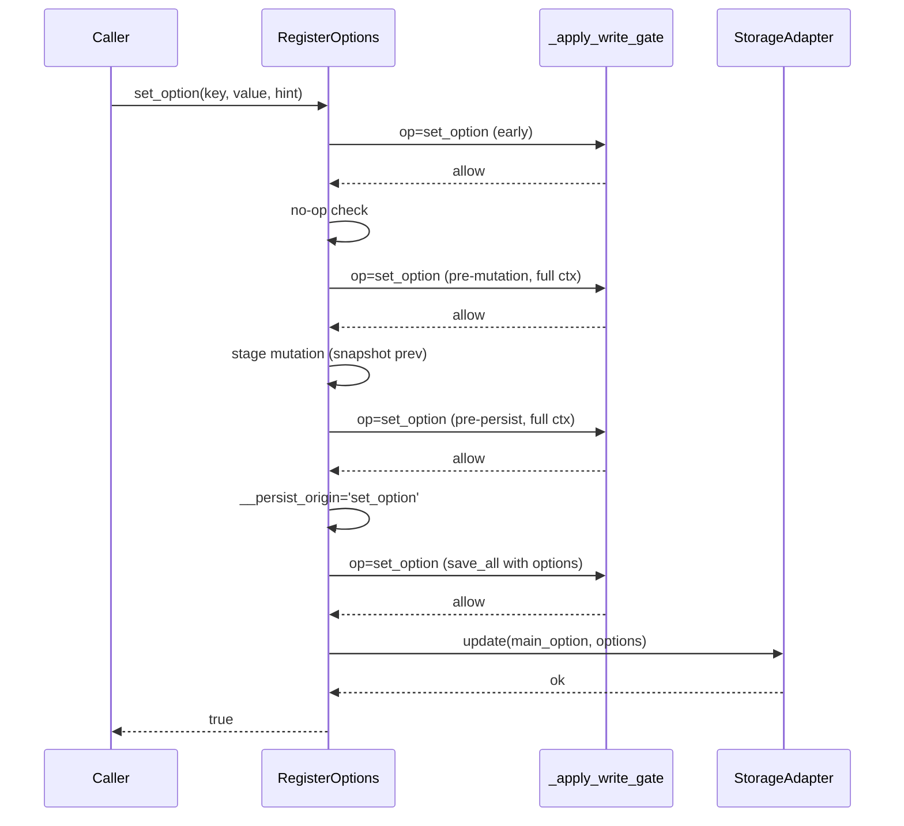
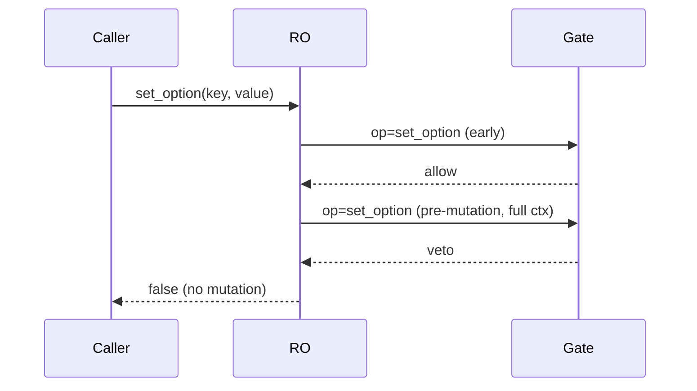
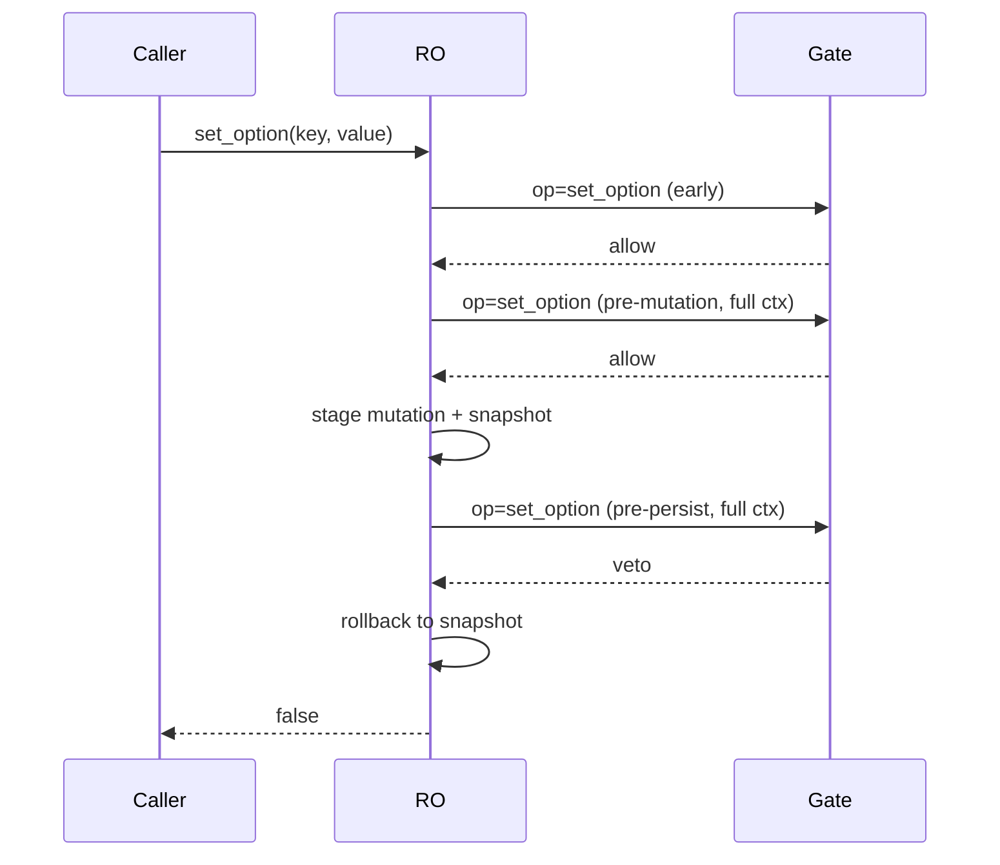
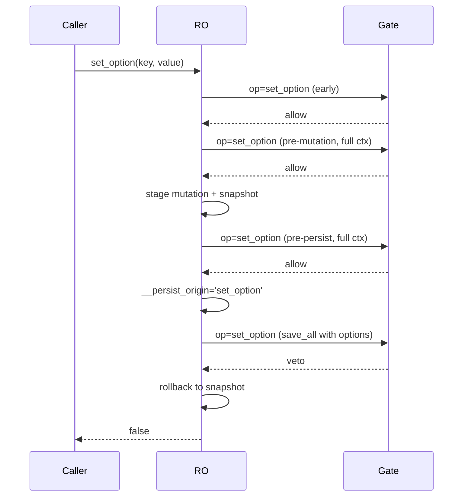

# TFS-003 — Write Permission Guards (RegisterOptions)

---

## description: Write-permission guards for in-memory and persistent option writes in RegisterOptions

This document describes the defensive write-guard mechanism in `inc/Options/RegisterOptions.php` that prevents unauthorized or unsafe mutations of:

- In-memory state (`$this->options`)
- Persistent storage (via the scope-aware storage adapter)

It covers control flow, filters, rollback guarantees, and extension points. Diagrams are included for typical flows and veto cases.

## Scope

- Applies to: `RegisterOptions::set_option()`, `add_option()`, `add_options()`, `delete_option()`, `clear()`, `seed_if_missing()`, `migrate()`, and `_save_all_options()`.
- Storage scopes supported via adapter: `Site`, `Blog`, `Network`, `User` (see `OptionScope`). Autoload support depends on scope.

## Core Ideas

- **Layered gates**: Early, pre-mutation, and pre-persist checks ensure no unauthorized state changes occur.
- **Two-level filters**: For every gate, both a base hook and a scope-specific hook are applied:
  - Base: `ran/plugin_lib/options/allow_persist`
  - Scope: `ran/plugin_lib/options/allow_persist/scope/{scope}`
- **Fail-fast with rollback**: Any veto at or after staging triggers rollback to the previous in-memory snapshot.
- **Origin-aware persistence**: `_save_all_options()` runs with an operation origin (e.g., `'set_option'`) so policy can consistently veto at the final boundary too.

## Policy Injection

- **Default**: If no policy is supplied, `RegisterOptions` lazily applies `RestrictedDefaultWritePolicy`.
- **Injection points**:
  - Constructor: `new RegisterOptions(..., ?WritePolicyInterface $policy = null)`
  - Factory: `RegisterOptions::from_config(..., array $storage_args = [], ?WritePolicyInterface $policy = null)`
  - Config accessor: `$config->options(['policy' => $customPolicy])`

Example via Config accessor:

```php
$opts = $config->options([
  'scope'  => 'site',
  'policy' => $customPolicy, // implements WritePolicyInterface
]);
```

## Gate Hooks and Context

All gates call `_apply_write_gate($op, $ctx)` with the following standardized filter hooks:

- `ran/plugin_lib/options/allow_persist`
- `ran/plugin_lib/options/allow_persist/scope/{scope}`

Common `ctx` fields (subset varies by op):

- `op`: operation name (e.g., `set_option`, `save_all`, `add_option`, `delete_option`, etc.)
- `main_option`: the main WP option name grouping all sub-options
- `key` | `keys`: single key or list of keys affected (when applicable)
- `autoload_hint` | `autoload`: metadata about autoload
- `scope`: storage scope enum value
- `blog_id`, `user_id`, `user_storage`, `user_global`: scope args (when applicable)
- `options`: when persisting, the full to-save value appears in context
- `mergeFromDb`: only for `_save_all_options(true)`

## `set_option()` Control Flow

Relevant code: `RegisterOptions::set_option()` around lines 340–424.

- Early gate (pre-storage interaction):
  - `op: 'set_option'`, context without `autoload_hint`
  - Veto here returns `false` with no mutation
- No-op check (strict comparison) prevents unnecessary writes
- Pre-mutation gate (with full context inc. `autoload_hint`):
  - Veto here returns `false` with no mutation (covers line ~401)
- Stage mutation + snapshot `$__prev_options`
- Pre-persist gate (same full context):
  - Veto here rolls back and returns `false` (covers lines ~413–414)
- Persist via `_save_all_options()` with origin `'set_option'`:
  - If vetoed or storage update fails, roll back to snapshot and return `false` (covers line ~421)

### Sequence: Success Path



### Sequence: Veto at Pre-Mutation



### Sequence: Veto at Pre-Persist (Rollback)



### Sequence: Veto at Save (Rollback)



## Other Operations (Summary)

- `add_option()` and `add_options()`
  - Gate before in-memory mutation; veto prevents mutation
- `delete_option()` and `clear()`
  - Gate before mutation; on allow, mutate and then persist via `_save_all_options()`
- `seed_if_missing()`
  - Gate before writing; veto returns without DB or memory effects
- `migrate()`
  - Gate before applying migration; veto returns without write/mutate
- `flush($mergeFromDb)` and `_save_all_options($mergeFromDb)`
  - Always gate before persistence; origin-op is `'save_all'` unless invoked from another operation (e.g., `'set_option'`)

## Implementation Pointers

- Early gate context (no `autoload_hint`): helps block writes before any storage interaction
- Full-context gates (`autoload_hint`, scope args present): used pre-mutation and pre-persist
- Save gate context includes `'options'`: distinguishes persistence pass from pre-gates
- Two-level filters fire in order: base then scoped. Implementers should consider both.

## Extension Examples

### Veto all writes for user scope (both in-memory mutation and persistent)

```php
add_filter('ran/plugin_lib/options/allow_persist', function ($allowed, $ctx) {
    if (($ctx['scope'] ?? '') === 'user') {
        return false; // veto all user-scope operations
    }
    return $allowed;
}, 10, 2);
```

### Allow pre-mutation but veto at pre-persist for a specific key

```php
add_filter('ran/plugin_lib/options/allow_persist', function ($allowed, $ctx) {
    if (($ctx['op'] ?? '') === 'set_option' && ($ctx['key'] ?? '') === 'dangerous_key') {
        // Count only the base filter to distinguish gates if needed externally
        return ($ctx['__phase'] ?? 'pre-persist') !== 'pre-persist' ? true : false;
    }
    return $allowed;
}, 10, 2);
```

Note: Internally we do not pass `__phase`; the above illustrates how a higher-level wrapper could tag calls if desired. In core, the pre-persist call is simply the second full-context gate invocation.

### Veto only at save-time for set_option

```php
add_filter('ran/plugin_lib/options/allow_persist', function ($allowed, $ctx) {
    if (($ctx['op'] ?? '') === 'set_option' && array_key_exists('options', $ctx)) {
        return false; // save-time veto
    }
    return $allowed;
}, 10, 2);
```

## Rollback Guarantees

- If veto occurs at pre-mutation: no in-memory changes are applied.
- If veto occurs at pre-persist or at save-time: in-memory changes are rolled back to the snapshot taken before staging.
- Storage update failure (adapter returns false) triggers the same rollback as a veto.

## Testing Notes

See `Tests/Unit/Options/RegisterOptionsWriteGateTest.php` for focused tests that:

- Veto at pre-mutation (covers ~401)
- Veto at pre-persist with rollback (covers ~413–414)
- Veto at save with rollback (covers ~421)

These tests demonstrate how to allow the early gate and target specific later gates, accounting for the base+scope filter invocations.

## References

- File: `inc/Options/RegisterOptions.php`
  - `set_option()` early/pre-mutation/pre-persist/save sequences
  - `_apply_write_gate()` filter application and scope hook
  - `_save_all_options()` origin-aware persistence and gate
- Storage adapters under `inc/Options/Storage/` (scope-dependent persistence)
