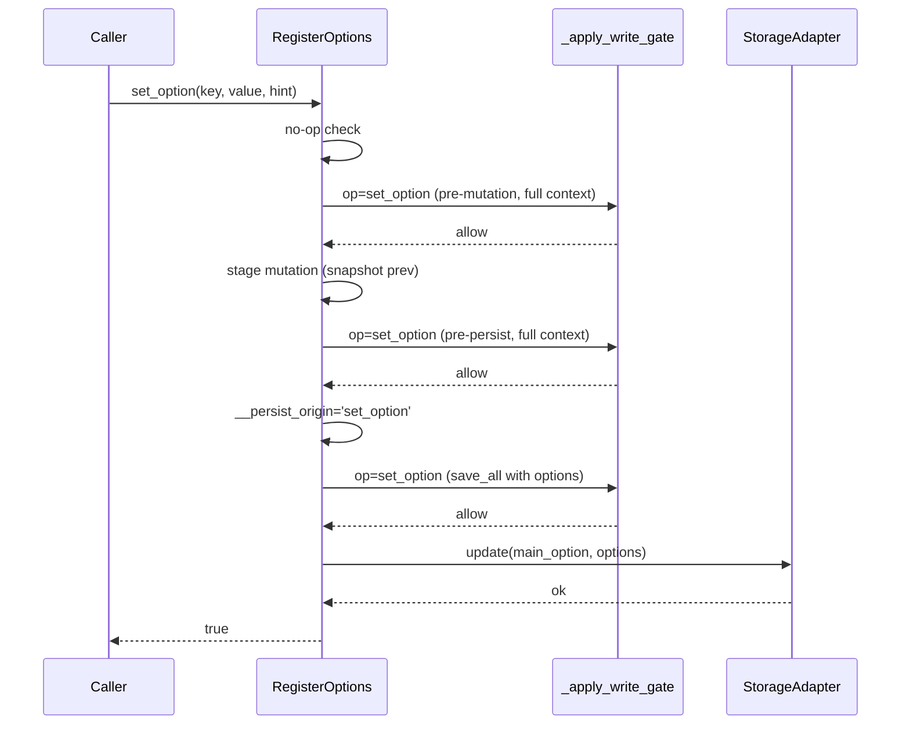
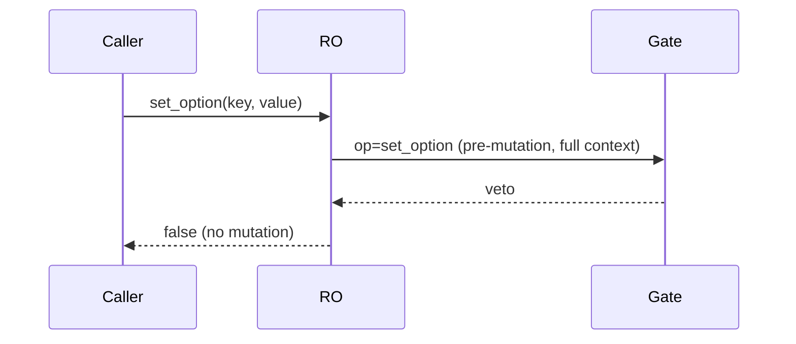
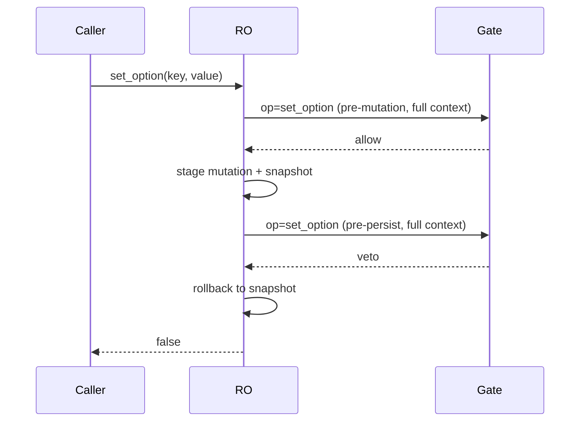
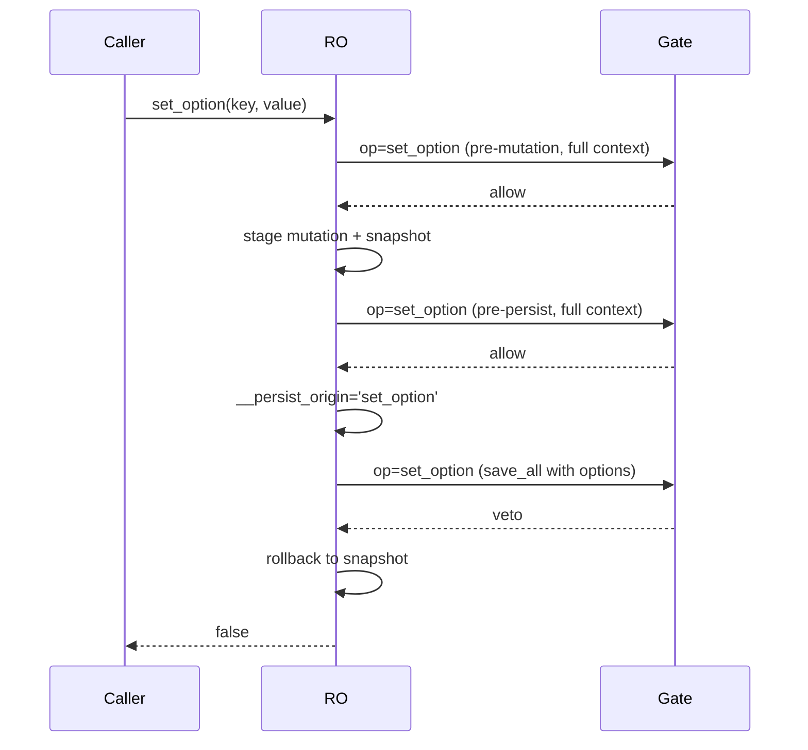

# TFS-003 — Write Permission Guards (RegisterOptions)

---

## description: Write-permission guards for in-memory and persistent option writes in RegisterOptions

This document describes the defensive write-guard mechanism in `inc/Options/RegisterOptions.php` that prevents unauthorized or unsafe mutations of:

- In-memory state (`$this->options`)
- Persistent storage (via the scope-aware storage adapter)

It covers control flow, filters, rollback guarantees, and extension points. Diagrams are included for typical flows and veto cases.

## Scope

- Applies to: `RegisterOptions::set_option()`, `add_option()`, `add_options()`, `delete_option()`, `clear()`, `seed_if_missing()`, `migrate()`, and `_save_all_options()`.
- Storage scopes supported via adapter: `Site`, `Blog`, `Network`, `User` (see `OptionScope`). Autoload support depends on scope.

## Core Ideas

- **Layered gates**: Pre-mutation, pre-persist, and final save-time checks ensure no unauthorized state changes occur.
- **Two-level filters**: For every gate, both a base hook and a scope-specific hook are applied:
  - Base: `ran/plugin_lib/options/allow_persist`
  - Scope: `ran/plugin_lib/options/allow_persist/scope/{scope}`
- **Fail-fast with rollback**: Any veto at or after staging triggers rollback to the previous in-memory snapshot.
- **Origin-aware persistence**: `_save_all_options()` runs with an operation origin (e.g., `'set_option'`) so policy can consistently veto at the final boundary too.
- **Immutable policy first**: An immutable `WritePolicyInterface` (defaults to `RestrictedDefaultWritePolicy`) is consulted before filters at each gate.

## Policy Injection

- **Default**: If no policy is supplied, `RegisterOptions` lazily applies `RestrictedDefaultWritePolicy`.
- **Injection points**:
  - Constructor: `new RegisterOptions(..., ?WritePolicyInterface $policy = null)`
  - Factory: `RegisterOptions::from_config(ConfigInterface $config, ?StorageContext $context = null, bool $autoload = true)`
  - Fluent on the returned manager: `$config->options(StorageContext::forSite())->with_policy($customPolicy)`

Example via fluent API on the returned manager:

```php
use Ran\PluginLib\Options\Storage\StorageContext;

$opts = $config->options(StorageContext::forSite()); // no writes
$opts->with_policy($customPolicy); // implements WritePolicyInterface
```

## Gate Hooks and Context

All gates call `_apply_write_gate($op, $wc)` where `$wc` is a typed `WriteContext`. The immutable policy is evaluated using this `WriteContext`.

For filter hooks, a derived array payload (referred to below as `context`) is constructed from the `WriteContext` and passed to WordPress filters. The following standardized filter hooks are applied:

- `ran/plugin_lib/options/allow_persist`
- `ran/plugin_lib/options/allow_persist/scope/{scope}`

Common filter `context` fields (subset varies by op):

- `op`: operation name (e.g., `set_option`, `save_all`, `add_option`, `delete_option`, etc.)
- `main_option`: the main WP option name grouping all sub-options
- `scope`: storage scope value (`site`, `network`, `blog`, `user`)
- `blog_id?`, `user_id?`, `user_storage?`, `user_global?`: scope args (when applicable)

Per-operation specifics:

- `set_option`:
  - `key: string`
- `add_option`:
  - `key: string`
- `add_options`:
  - `keys: array<int,string>`
- `delete_option`:
  - `key: string`
- `clear`:
  - no additional keys beyond common
- `seed_if_missing`:
  - `keys: array<int,string>`
- `migrate`:
  - `changed_keys: array<int,string>`
- `save_all` (final persistence gate):
  - `options: array<string,mixed>` (full to-save payload)
  - `merge_from_db: bool` (only when `_save_all_options(true)`)

Notes:

- The presence of `options` in the filter `context` distinguishes the final save gate from pre-mutation/pre-persist gates.
- The immutable write policy is evaluated before either filter hook and can veto immediately.

## About WriteContext (reference)

WriteContext is a typed, immutable description of a write operation used by the internal, immutable policy prior to any WordPress filters. It centralizes validation and ensures consistent gate inputs across operations.

Key aspects:

- Purpose: provide strongly-typed gate inputs for policy decisions.
- Construction: via static factories per operation (e.g., `WriteContext::for_set_option(...)`, `::for_save_all(...)`).
- Validation: factories normalize scope and enforce required IDs for blog/user scopes.

Core fields (getter methods):

- `op(): string` — operation name (e.g., `set_option`, `add_options`, `save_all`).
- `main_option(): string` — main WordPress option key.
- `scope(): string` — one of `site|network|blog|user`.
- `blogId(): ?int`, `userId(): ?int` — scope-specific identifiers.
- `user_storage(): ?string`, `user_global(): bool` — user-scope storage details.
- `merge_from_db(): bool` — save-time merge hint (when applicable).
- `key(): ?string`, `keys(): ?array<int,string>`, `options(): ?array<string,mixed>`, `changed_keys(): ?array<int,string>` — op-specific metadata.

Further reading:

- Implementation: `inc/Options/WriteContext.php`
- Design TFS: `inc/Options/docs/TFS-00X-WriteContext-Policy-Typing.md`

### Examples

- Wiring a user-scope self-service whitelist policy (ExampleUserSelfServiceWhitelistPolicy): `inc/Options/docs/examples/policy-example-subscriber.php`

Related building blocks:

- Abstract base for policy helpers: `inc/Options/Policy/AbstractWritePolicy.php`
- AND-composite to stack multiple policies: `inc/Options/Policy/WritePolicy.php`

### Choose your path

- Basic (recommended default):

  - Use `RestrictedDefaultWritePolicy` only (no composition). Aligns with WordPress capabilities by scope.
  - Example wiring: `inc/Options/docs/examples/policy-example-subscriber.php`

- Advanced (optional, application rules):
  - Compose policies with `WritePolicy` (AND semantics) for stricter control.
  - Common pattern: `new WritePolicy(new RestrictedDefaultWritePolicy(), new ExampleUserSelfServiceWhitelistPolicy())`
  - Single-policy example: `inc/Options/docs/examples/policy-example-subscriber.php`
  - Composite example: `inc/Options/docs/examples/policy-example-composite.php`

## `set_option()` Control Flow

Relevant code: method `RegisterOptions::set_option()`.

- No-op check (strict comparison) prevents unnecessary writes
- Pre-mutation gate (with full context including scope args):
  - Veto here returns `false` with no mutation
- Stage mutation + snapshot `$__prev_options`
- Pre-persist gate (same full context):
  - Veto here rolls back and returns `false`
- Persist via `_save_all_options()` with origin `'set_option'`:
  - If vetoed or storage update fails, roll back to snapshot and return `false`

### Sequence: Success Path



### Sequence: Veto at Pre-Mutation



### Sequence: Veto at Pre-Persist (Rollback)



### Sequence: Veto at Save (Rollback)



## Other Operations (Summary)

- `add_option()` and `add_options()`
  - Gate before in-memory mutation; veto prevents mutation
- `delete_option()` and `clear()`
  - Gate before mutation; on allow, mutate and then persist via `_save_all_options()`
- `seed_if_missing()`
  - Gate before writing; veto returns without DB or memory effects
- `migrate()`
  - Gate before applying migration; veto returns without write/mutate
- `flush($merge_from_db)` and `_save_all_options($merge_from_db)`
  - Always gate before persistence; origin-op is `'save_all'` unless invoked from another operation (e.g., `'set_option'`)

## Implementation Pointers

- Pre-mutation gate (with full context): used before any in-memory mutation
- Pre-persist gate (same full context): used after staging to allow rollback on veto
- Save gate context includes `'options'`: distinguishes persistence pass from pre-gates
- Two-level filters fire in order: base then scoped. Implementers should consider both.
- An immutable policy is evaluated before filters at each gate.

## Extension Examples

### Veto all writes for user scope (both in-memory mutation and persistent)

```php
add_filter('ran/plugin_lib/options/allow_persist', function ($allowed, $context) {
    if (($context['scope'] ?? '') === 'user') {
        return false; // veto all user-scope operations
    }
    return $allowed;
}, 10, 2);
```

### Allow pre-mutation but veto at pre-persist for a specific key

```php
add_filter('ran/plugin_lib/options/allow_persist', function ($allowed, $context) {
    if (($context['op'] ?? '') === 'set_option' && ($context['key'] ?? '') === 'dangerous_key') {
        // Count only the base filter to distinguish gates if needed externally
        return ($context['__phase'] ?? 'pre-persist') !== 'pre-persist' ? true : false;
    }
    return $allowed;
}, 10, 2);
```

### Veto only at save-time for set_option

```php
add_filter('ran/plugin_lib/options/allow_persist', function ($allowed, $context) {
    if (($context['op'] ?? '') === 'set_option' && array_key_exists('options', $context)) {
        return false; // save-time veto
    }
    return $allowed;
}, 10, 2);
```

## Rollback Guarantees

- If veto occurs at pre-mutation: no in-memory changes are applied.
- If veto occurs at pre-persist or at save-time: in-memory changes are rolled back to the snapshot taken before staging.
- Storage update failure (adapter returns false) triggers the same rollback as a veto.

## Testing Notes

See `Tests/Unit/Options/RegisterOptionsWriteGateTest.php` for focused tests that:

- Veto at pre-mutation
- Veto at pre-persist with rollback
- Veto at save with rollback

These tests demonstrate how to allow the pre-mutation gate and target specific later gates, accounting for the base+scope filter invocations.

## References

- File: `inc/Options/RegisterOptions.php`
  - `set_option()` pre-mutation/pre-persist/save sequences
  - `_apply_write_gate()` policy + filter application and scope hook
  - `_save_all_options()` origin-aware persistence and gate
- Storage adapters under `inc/Options/Storage/` (scope-dependent persistence)
